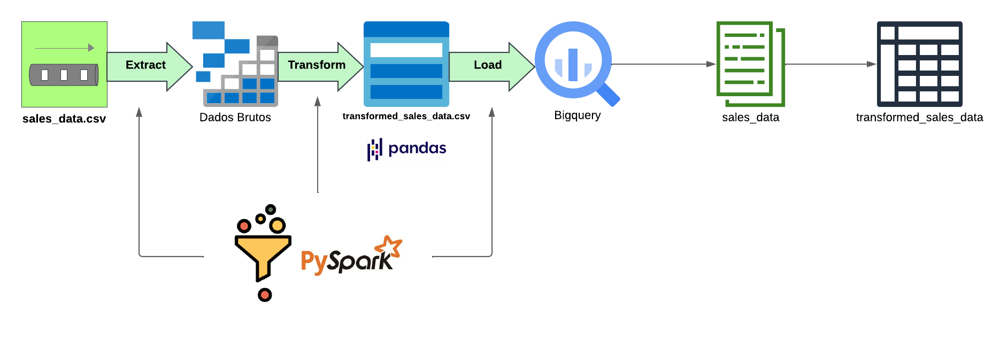

# ETL Pipeline: Projeto de Vendas



Este repositório contém um pipeline ETL (Extract, Transform, Load) desenvolvido para processar dados de vendas. O objetivo é extrair os dados brutos, transformá-los conforme as regras de negócios e carregá-los em um banco de dados na nuvem, utilizando ferramentas modernas e escaláveis.

## Objetivo do Projeto

O objetivo deste projeto é construir um pipeline ETL robusto para processar e analisar dados de vendas. Ele cobre todas as etapas do ETL:

1. **Extração**: Coleta de dados de um arquivo CSV com informações de vendas.
2. **Transformação**: Aplicação de cálculos e categorização dos dados, incluindo:
   - Cálculo de receita total por venda.
   - Classificação dos preços em categorias ("Low", "Medium", "High").
3. **Carregamento**: Armazenamento dos dados transformados em um banco de dados na nuvem (Google BigQuery).

## Tecnologias Utilizadas

- **Python**: Linguagem principal para o desenvolvimento do pipeline.
- **Apache Spark**: Processamento distribuído de grandes volumes de dados.
- **Pandas**: Manipulação de dados em memória.
- **Google BigQuery**: Armazenamento e análise de dados na nuvem.
- **Git**: Controle de versão do código.
- **VSCode**: Ambiente de desenvolvimento integrado.

## Estrutura do Repositório

- `data_generation/`: Contém o script de geração de dados fictícios de vendas.
  - [`generate_sales_data.py`](data_generation/generate_sales_data.py)
- `data_loading/`: Contém o script para carregar dados no BigQuery.
  - [`to_big_query.py`](data_loading/to_big_query.py)
- `data_transformation/`: Contém o script de transformação e os dados transformados.
  - [`transform_sales_data.py`](data_transformation/transform_sales_data.py)
  - `transformed_data/`: Contém os dados transformados.
    - [`transformed_sales_data.csv`](data_transformation/transformed_data/transformed_sales_data.csv)
- [`sales_data.csv`](sales_data.csv): Dados de vendas brutos fictícios.
- [`README.md`](README.md): Documentação do projeto.
- [`requirements.txt`](requirements.txt): Dependências do projeto.
- [`gcp_key.json`](gcp_key.json): Chave de autenticação para o Google Cloud Platform.

## Instalação

1. Clone o repositório:
   ```sh
   git clone https://github.com/seu-usuario/etl-pipeline-projeto-vendas.git
   cd etl-pipeline-projeto-vendas
   ```
2. Crie e ative um ambiente virtual:
   ```py
   python -m venv venv
   source venv/bin/activate  # No Windows use `venv\Scripts\activate`
   ```
3. Instale as dependências:
   ```sh
   pip install -r requirements.txt
  	```

## Uso

1. Geração de Dados Fictícios:
   ```sh
   python data_generation/generate_sales_data.py
   ```
2. Transformação de Dados
   ```sh
   python data_transformation/transform_sales_data.py
   ```
3. Carregamento de Dados
   ```sh
   python data_loading/to_big_query.py
   ```

# Detalhamento do Carregamento para o BigQuery

## Configuração do Ambiente no GCP

1. Criação do Dataset no BigQuery:
   - Acesse o console do Google Cloud Platform e crie um dataset chamado sales_data por exemplo.

2. Configuração da Autenticação:
   - Gere uma chave JSON para a conta de serviço do projeto no GCP.
   - Salve a chave como gcp_key.json na raiz do repositório.
   - Configure a variável de ambiente no terminal:
```sh
export GOOGLE_APPLICATION_CREDENTIALS=gcp_key.json
```
## Execução do Script to_big_query.py

1. Localize o Arquivo Transformado:
   - Certifique-se de que o arquivo transformed_sales_data.csv está na pasta data_transformation/transformed_data/.

2. Execute o Script:
   ```sh
   python data_loading/to_big_query.py
  ```
3. Verifique a Saída:
   - O terminal deve exibir uma mensagem confirmando o carregamento com sucesso, como:
   ```sh
   Dados carregados com sucesso na tabela pipeline-projeto-vendas.sales_data.transformed_sales_data. Total de linhas: 100
   ```
4. Validação no Console do BigQuery:
   - Navegue até o dataset sales_data no GCP e abra a tabela transformed_sales_data para validar os dados carregados.
   
## Contribuição

Contribuições são bem-vindas! Sinta-se à vontade para abrir issues e pull requests.

## Responsável Técnico

Projeto mantido por **Cézar Augusto Meira Carmo.** 

Para mais informações: **dataengineercezar@egmail.com**


